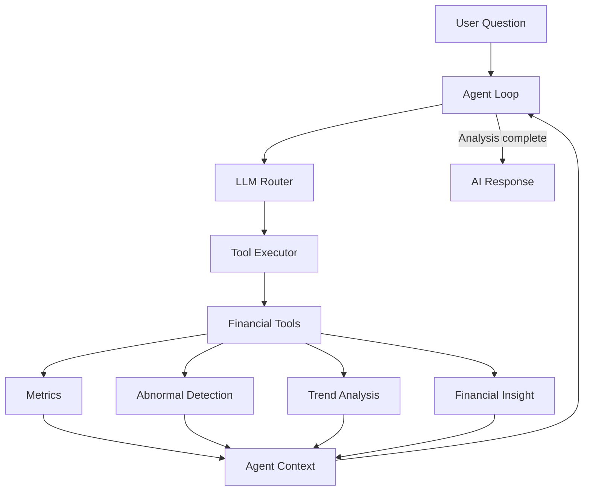
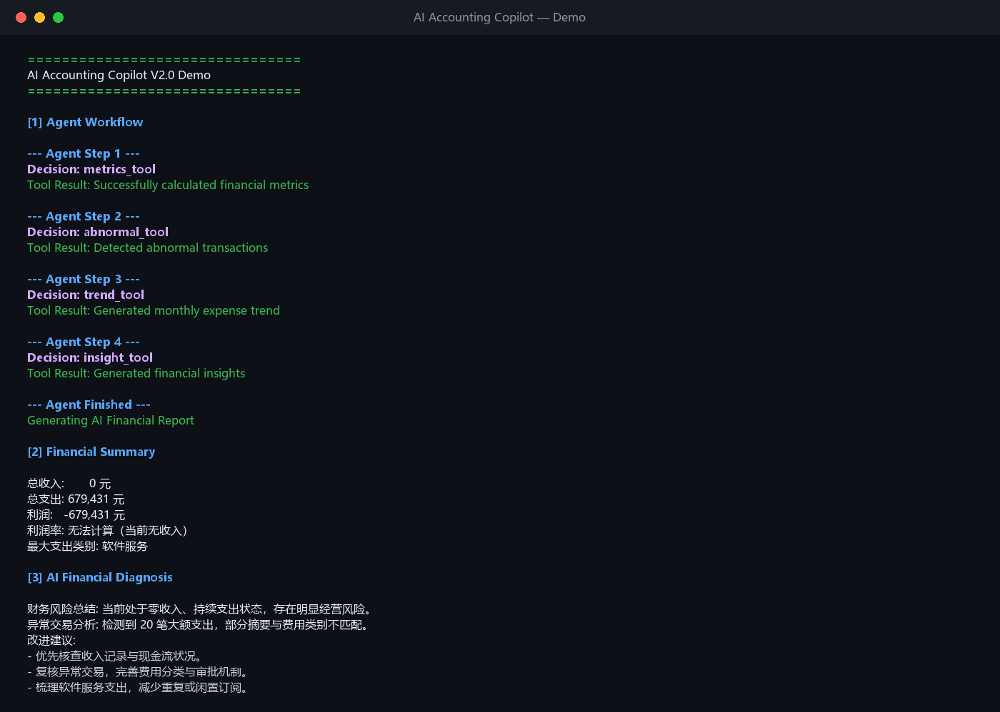

# AI Accounting Copilot

> An LLM-powered financial analysis agent that combines accounting data processing with intelligent tool orchestration.

AI Accounting Copilot 将结构化财务分析能力与 LLM Agent 结合：系统读取 Excel 财务数据，通过 Router 决定下一步动作，由 Agent Loop 协调工具执行，并基于完整分析上下文生成中文财务诊断结果。

当前版本由早期的传统财务分析流程演进而来，目标是展示一个结构清晰、可运行、可扩展的 **AI + Accounting + LLM Agent** 项目。

## Project Overview

传统财务分析脚本通常按照预设顺序完成数据读取、指标计算、异常检测和报告输出。本项目在保留这些确定性分析能力的基础上，引入 LLM Router、Agent Loop、Tool Executor 和 Context，将单向脚本升级为具备工具调度与状态管理能力的财务分析 Agent。

系统目前可以：

- 从 Excel 读取结构化财务数据
- 计算收入、支出、利润、利润率等核心指标
- 根据阈值识别异常大额支出
- 汇总月度支出趋势
- 生成规则化经营洞察
- 由 LLM 综合工具结果，输出中文财务风险诊断与建议

> 本项目用于技术演示和辅助分析，不构成审计意见、会计结论或投资建议。

## Evolution

### V1.0 — Traditional Financial Analysis

项目最初是一个普通 Python 财务分析系统，采用固定流水线完成：

```text
Excel Data
    ↓
Data Processing
    ↓
Metrics / Anomaly / Trend Analysis
    ↓
Charts and TXT Report
```

V1.0 验证了 Excel 读取、财务指标计算、异常检测、趋势分析、图表生成和文本报告生成等基础能力，但执行路径固定，各模块之间主要依赖传统函数调用。

### V2.0 — LLM Agent Architecture

当前版本将核心分析模块封装为 Agent Tools，并增加 LLM 路由、执行循环、统一上下文和最终 AI 响应层：

```text
User Question
    ↓
Agent Loop
    ↓
LLM Router
    ↓
Tool Executor
    ↓
Financial Tools
    ↓
Agent Context
    ↓
Agent Loop
    ↓
AI Response
```

升级后的系统不再让旧版 TXT 报告工具参与 Agent 主流程。所有分析工具执行完成后，由 `agent_response.py` 基于 Context 统一生成最终回答，避免重复生成报告。

## Features

### Financial Metrics Analysis

`metrics_tool` 负责计算：

- 总收入
- 总支出
- 利润
- 利润率
- 最大支出类别

当总收入为 0 时，利润率返回 `None`，防止系统将“无法计算”错误解释为 0% 利润率。

### Abnormal Transaction Detection

`abnormal_tool` 根据配置阈值筛选异常大额支出，并将结果写入 Agent Context，供后续经营洞察和最终 AI 诊断使用。

### Trend Analysis

`trend_tool` 将日期字段转换为时间类型，按月份汇总支出，用于识别支出变化和月度波动。

### AI Financial Diagnosis

系统将财务指标、异常交易、趋势结果和规则化洞察提交给 LLM，生成包含风险解释和改进建议的中文财务分析结果。

### Agent Tool Orchestration

Agent 当前按依赖关系完成以下工具链：

```text
metrics_tool
    ↓
abnormal_tool
    ↓
trend_tool
    ↓
insight_tool
    ↓
finish
    ↓
AI Response
```

只有返回 `success: true` 的工具才会加入 `completed_tools`。Agent Loop 同时限制最大执行步数，并阻止重复调用、越级调用和提前结束。

## System Architecture



| Component | Responsibility |
|---|---|
| LLM Router | 根据用户问题和当前 Context 返回下一步动作 |
| Agent Loop | 控制执行顺序、完成条件、失败处理和最大步数 |
| Tool Executor | 将工具名称分发到对应的财务工具 |
| Financial Tools | 调用确定性的指标、异常、趋势和洞察模块 |
| Context | 保存问题、数据、工具结果、历史与完成状态 |
| AI Response | 汇总完整 Context 并生成最终财务分析 |

## Agent Workflow

1. `main.py` 读取 Excel 数据并接收用户问题。
2. `AgentContext` 初始化数据、问题和执行状态。
3. LLM Router 根据问题及已完成工具决定下一步动作。
4. Agent Loop 校验工具顺序，避免重复或越级执行。
5. Tool Executor 调用对应 Financial Tool。
6. 工具成功后更新 Context，并写入 `completed_tools`。
7. 四个分析工具全部完成后，Agent 结束工具循环。
8. AI Response 综合 Context，生成最终中文财务诊断。

## Demo

下面展示一次完整 Agent 运行中的工具调度和精简财务诊断。每一步由 Agent Loop 协调，LLM Router 给出决策，确定性财务工具负责实际计算：



> 查看[终端文本版本](docs/demo/agent_demo_output.txt)和[Demo 说明](docs/demo/README_demo.md)。

该流程说明项目并非将原始财务数据直接交给 LLM 后返回文本，而是先调度多个可验证的财务分析工具，再由 AI Response 汇总结构化结果。

## Tech Stack

- **Python** — 项目主语言
- **Pandas** — Excel 数据处理与财务聚合
- **OpenPyXL** — `.xlsx` 文件读取支持
- **OpenAI Python SDK** — 调用 OpenAI-compatible LLM API
- **DeepSeek Chat** — 当前 Router 和 AI Response 使用的模型服务
- **python-dotenv** — 本地环境变量管理
- **unittest** — Agent 流程与核心逻辑测试

## Project Structure

```text
AI-Accounting-Copilot/
├── data/
│   └── demo_financial_data.xlsx    # 示例财务数据
├── docs/
│   └── architecture.md             # 架构说明
├── output/                         # 可选导出目录（Git 忽略）
├── src/
│   ├── agent/
│   │   ├── agent_executor.py       # 工具执行分发
│   │   ├── agent_loop.py           # Agent 主循环
│   │   ├── agent_response.py       # 最终 AI 回答
│   │   ├── context.py              # Agent 状态容器
│   │   ├── llm_router.py           # LLM 工具路由
│   │   └── tools.py                # Agent 财务工具
│   ├── ai_analyzer.py              # LLM 客户端配置
│   ├── analyzer.py                 # 异常支出检测
│   ├── data_generator.py           # 示例数据生成
│   ├── insight.py                  # 财务洞察规则
│   ├── metrics.py                  # 财务指标计算
│   ├── report.py                   # 可选 TXT 导出，不参与 Agent 主流程
│   └── trend.py                    # 月度趋势分析
├── tests/
│   └── test_agent_v1.py            # 核心逻辑与 Agent 流程测试
├── config.py                       # 路径与异常阈值配置
├── generate_test_data.py           # 示例数据生成入口
├── main.py                         # 项目运行入口
├── requirements.txt
└── README.md
```

## Installation

### 1. Enter the project directory

```bash
cd AI-Accounting-Copilot
```

### 2. Create and activate a virtual environment

```bash
python -m venv .venv
```

Windows PowerShell：

```powershell
.\.venv\Scripts\Activate.ps1
```

macOS / Linux：

```bash
source .venv/bin/activate
```

### 3. Install dependencies

```bash
pip install -r requirements.txt
```

### 4. Configure the LLM API key

在项目根目录创建 `.env`：

```env
DEEPSEEK_API_KEY=your_api_key_here
```

`.env` 已加入 `.gitignore`，请勿提交真实密钥。

### 5. Prepare financial data

默认入口读取 `data/demo_financial_data.xlsx`。Excel 数据应包含以下字段：

```text
日期 | 摘要 | 类别 | 收入 | 支出
```

也可以生成新的演示数据：

```bash
python generate_test_data.py
```

### 6. Run the Agent

```bash
python main.py
```

### 7. Run tests

```bash
python -m unittest discover -s tests -v
```

## Roadmap

以下内容属于后续规划，当前版本尚未实现：

- 支持用户动态输入问题和数据文件路径
- 增加收入趋势、现金流和预算偏差分析工具
- 引入更灵活的工具依赖规划与多轮对话
- 增加结构化日志、调用耗时和 Token 用量监控
- 扩展为 Web API 或交互式前端
- 增加更多异常场景、失败重试和边界条件测试
- 支持敏感财务数据脱敏及本地模型部署方案

## License

当前仓库尚未配置开源许可证。如需公开复用，请先补充适合项目的 `LICENSE` 文件。
