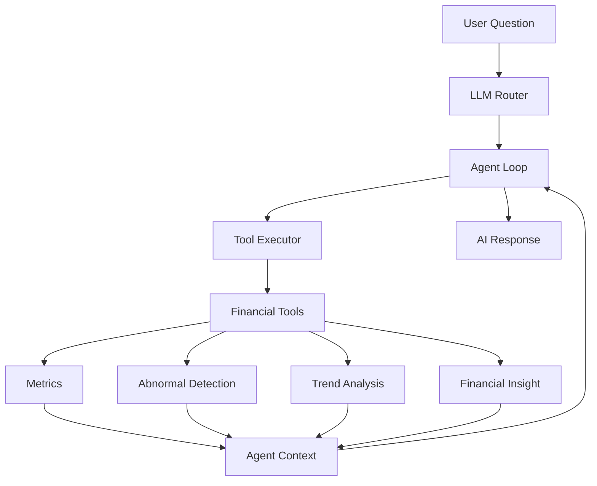

# AI Accounting Copilot

> An AI-powered accounting analysis agent combining deterministic financial analytics with LLM-based tool orchestration and automated financial diagnosis.

AI Accounting Copilot is a portfolio-ready AI application built with Python, Pandas, Streamlit, and DeepSeek.

The project evolved from a traditional financial analysis pipeline into an LLM Agent system that coordinates deterministic accounting tools, manages execution context, and generates management-oriented financial diagnosis.

🚀 **Live Demo:** [Open AI Accounting Copilot](https://ai-accounting-copilot-7cjjkjuzcvvhbka3bq3d54.streamlit.app/)


---

# Demo Preview


## Dashboard


Additional views:

- [Agent workflow](docs/screenshots/agent_workflow.png)
- [Financial report](docs/screenshots/financial_report.png)
- [Abnormal detection](docs/screenshots/abnormal_detection.png)


---

# Features

## Excel Financial Analysis

- Reads structured accounting data from `.xlsx` and `.xls` files
- Validates required financial fields
- Calculates core financial indicators

Supported fields:

```
日期 | 摘要 | 类别 | 收入 | 支出
```


## AI Financial Diagnosis

The system combines deterministic analysis results with an LLM to generate:

- Financial risk assessment
- Cost structure analysis
- Abnormal transaction explanation
- Management recommendations


## LLM Agent Workflow

Instead of a fixed script pipeline, the system uses:

- LLM Router
- Agent Loop
- Tool Executor
- Agent Context

The LLM decides the next action, while deterministic tools perform reliable financial calculations.


## Financial Tool Calling

Current Agent tools:

- `metrics_tool`
  - Revenue
  - Expense
  - Profit
  - Profit margin
  - Largest expense category

- `abnormal_tool`
  - High-value transaction detection
  - Expense anomaly identification

- `trend_tool`
  - Monthly expense trend analysis

- `insight_tool`
  - Financial interpretation and recommendations


## Interactive Dashboard

The Streamlit Web application provides:

- Excel upload
- KPI dashboard
- Agent workflow visualization
- Monthly expense charts
- Abnormal transaction tables
- AI-generated financial report download


---

# Project Evolution


```
v1.0  Traditional Financial Analysis
        ↓
v2.0  LLM Agent Architecture
        ↓
v2.1  Streamlit Web Interface
        ↓
v2.2  Dashboard Productization
        ↓
v2.3  Deployment Release
```


See the complete:

[Version History](docs/version_history.md)


---

# Architecture





The system does not simply generate text.

The LLM determines which tools should be executed, while financial calculations remain deterministic and transparent.

The Agent Loop manages:

- Tool execution order
- Completed tool states
- Context persistence
- Final response generation


## Agent Workflow


```
User Question

      ↓

LLM Router

      ↓

Agent Loop

      ↓

Tool Executor

      ↓

metrics_tool
      ↓
abnormal_tool
      ↓
trend_tool
      ↓
insight_tool

      ↓

Agent Context

      ↓

AI Financial Diagnosis
```


---

# Web Demo


The application is deployed on Streamlit Cloud.

Users can directly:

- Upload Excel financial data
- Run AI Agent analysis
- View financial dashboard
- Review abnormal transactions
- Download AI-generated reports


## Live Demo


**Demo URL:**

https://ai-accounting-copilot-7cjjkjuzcvvhbka3bq3d54.streamlit.app/


Run locally:


```bash
streamlit run web_app.py
```


---

# Tech Stack


- Python
- Pandas
- Streamlit
- DeepSeek LLM
- OpenAI-compatible Python SDK
- Agent Architecture
- OpenPyXL
- xlrd


---

# Project Structure


```
AI-Accounting-Copilot/

├── .streamlit/
│   └── Cloud deployment configuration

├── data/
│   └── Demo financial data

├── docs/
│   ├── Architecture documentation
│   ├── Screenshots
│   ├── Demo GIF
│   └── Release notes


├── src/

│   ├── agent/
│   │   ├── agent_loop.py
│   │   ├── agent_executor.py
│   │   ├── agent_response.py
│   │   ├── context.py
│   │   ├── llm_router.py
│   │   └── tools.py

│   ├── web/
│   │   ├── dashboard.py
│   │   ├── report_view.py
│   │   └── ui_components.py

│   ├── ai_analyzer.py
│   ├── analyzer.py
│   ├── data_loader.py
│   ├── insight.py
│   ├── metrics.py
│   └── trend.py


├── tests/

├── main.py

├── web_app.py

└── requirements.txt
```


---

# Installation


Clone repository:


```bash
git clone https://github.com/Palomita-finance/AI-Accounting-Copilot.git

cd AI-Accounting-Copilot
```


Create environment:


```bash
python -m venv .venv
```


Install dependencies:


```bash
pip install -r requirements.txt
```


---

# API Configuration


Create `.env` in project root:


```env
DEEPSEEK_API_KEY=your_api_key
```


For Streamlit Cloud:

Add:


```toml
DEEPSEEK_API_KEY="your_api_key"
```


in Streamlit Secrets.


Never commit real API keys.


---

# Run


## CLI Version


```bash
python main.py
```


## Web Version


```bash
streamlit run web_app.py
```


## Tests


```bash
python -m unittest discover -s tests -v
```


---

# Documentation


- [Project Description](docs/project_description.md)
- [Architecture](docs/architecture.md)
- [Version History](docs/version_history.md)
- [v2.2 Release Notes](docs/release_v2.2.md)
- [v2.3 Release Notes](docs/release_v2.3.md)


---

# Future Roadmap


- Database integration
- Multi-agent collaboration
- Local LLM deployment
- Enterprise accounting workflow
- Automated financial workflow integration


---

# Disclaimer


This project is designed for technical demonstration and decision-support scenarios.

It does not provide audit assurance, accounting certification, or investment advice.


---

# License


This repository does not currently include an open-source license.

Add a `LICENSE` file before distributing or accepting external contributions.
```
