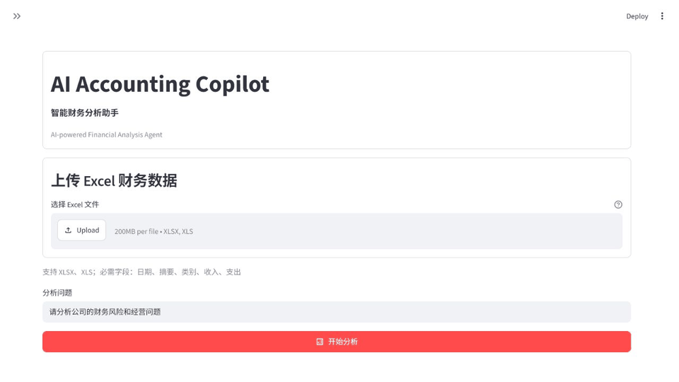
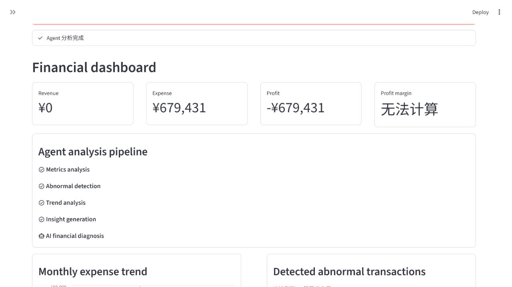
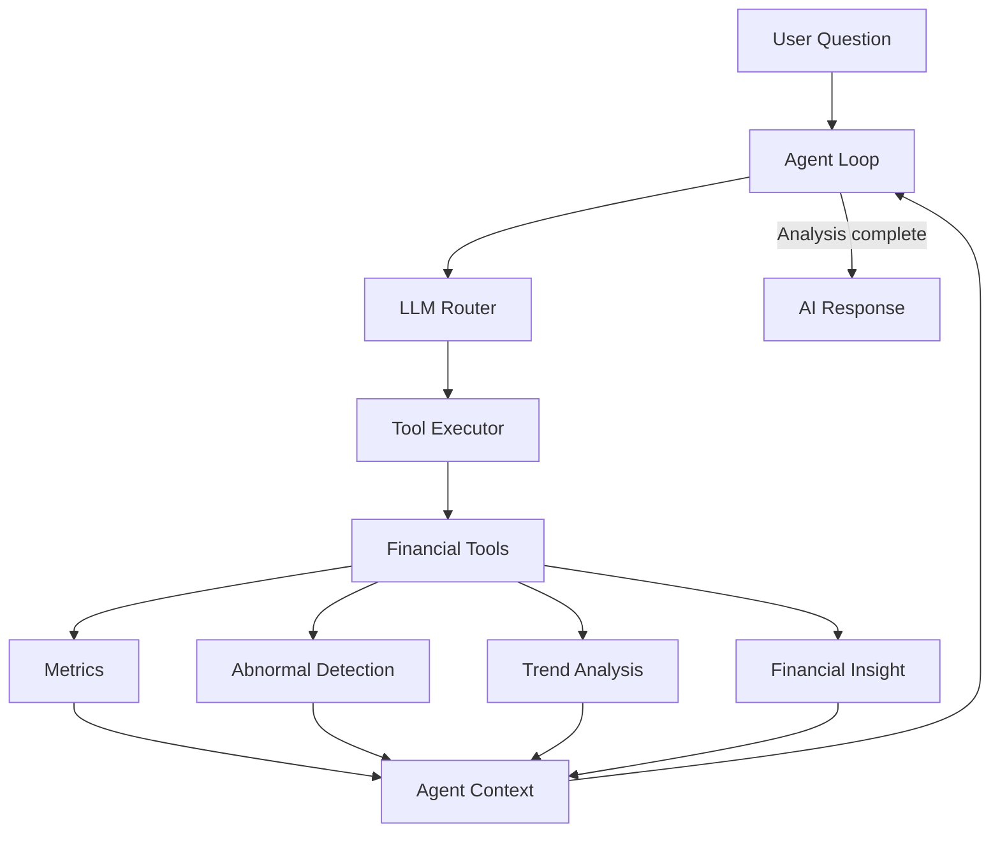

# AI Accounting Copilot

> An AI-powered accounting analysis agent combining financial analytics with LLM tool orchestration.

AI Accounting Copilot is a portfolio-ready AI application built with Python, Pandas, Streamlit, and DeepSeek. It evolved from a traditional financial analysis pipeline into an LLM Agent that orchestrates deterministic accounting tools before generating a management-oriented diagnosis.

🚀 **Live Demo:** [Open AI Accounting Copilot](https://ai-accounting-copilot-7cjkjuzcvvhbka3bq3d54.streamlit.app/)

## Demo Preview



## Demo



Additional views: [Agent workflow](docs/screenshots/agent_workflow.png) · [Financial report](docs/screenshots/financial_report.png) · [Abnormal detection](docs/screenshots/abnormal_detection.png)

## Features

- **Excel Financial Analysis** — Reads structured accounting data from `.xlsx` and `.xls` files.
- **AI Financial Analysis** — Generates a structured diagnosis from completed financial analysis results.
- **LLM Agent Workflow** — Uses an LLM Router and Agent Loop to coordinate execution.
- **Financial Tool Calling** — Runs deterministic metrics, anomaly, trend, and insight tools.
- **Risk Detection** — Identifies abnormal high-value expense transactions.
- **Trend Analysis** — Aggregates monthly expenses and presents an interactive trend chart.
- **Interactive Dashboard** — Supports Excel upload, KPI cards, workflow status, tables, and report download.

## Evolution

```text
v1.0  Traditional Financial Analysis
  ↓
v2.0  LLM Agent Architecture
  ↓
v2.1  Streamlit Web Interface
  ↓
v2.2  Dashboard Productization
  ↓
v2.3  Deployment Release
```

See the complete [Version History](docs/version_history.md).

## Architecture



The system does not simply generate text. The LLM decides when and how to call deterministic financial tools. The Agent Loop validates the execution order, successful results are stored in Context, and AI Response generates the final report from the completed analysis state.

### Agent workflow

```text
User Question
    ↓
Agent Loop ↔ LLM Router
    ↓
Tool Executor
    ↓
metrics_tool → abnormal_tool → trend_tool → insight_tool
    ↓
Agent Context
    ↓
AI Financial Diagnosis
```

## Web Demo

Users can upload Excel financial data and receive an AI-generated financial diagnosis through a browser interface. The Streamlit application provides schema validation, KPI metrics, Agent workflow visualization, monthly expense trends, abnormal transaction review, and Markdown report download.

## Live Demo

The application is deployed on Streamlit Cloud:

**Demo URL:** [https://ai-accounting-copilot-7cjkjuzcvvhbka3bq3d54.streamlit.app/](https://ai-accounting-copilot-7cjkjuzcvvhbka3bq3d54.streamlit.app/)

Users can directly:

- Upload Excel financial data
- Run AI Agent analysis
- View the financial dashboard
- Download the AI-generated report

```bash
streamlit run web_app.py
```

## Tech Stack

- Python
- Pandas
- Streamlit
- DeepSeek LLM
- OpenAI-compatible Python SDK
- Agent Architecture
- OpenPyXL / xlrd

## Project Structure

```text
AI-Accounting-Copilot/
├── .streamlit/                 # Cloud deployment configuration
├── data/                       # Demo financial data
├── docs/                       # Architecture, screenshots, release docs
├── src/
│   ├── agent/                  # LLM Agent core
│   ├── web/                    # Streamlit presentation components
│   ├── ai_analyzer.py          # LLM client and Secrets integration
│   ├── analyzer.py             # Abnormal expense detection
│   ├── data_loader.py          # Excel loading
│   ├── insight.py              # Financial insight rules
│   ├── metrics.py              # Financial metrics
│   └── trend.py                # Monthly trend analysis
├── tests/
├── main.py                     # CLI entry point
├── web_app.py                  # Streamlit entry point
└── requirements.txt
```

## Installation

```bash
git clone https://github.com/Palomita-finance/AI-Accounting-Copilot.git
cd AI-Accounting-Copilot
python -m venv .venv
```

Activate the environment and install dependencies:

```bash
pip install -r requirements.txt
```

### API configuration

For local development, create `.env` in the project root:

```env
DEEPSEEK_API_KEY=your_api_key
```

For Streamlit Community Cloud, add `DEEPSEEK_API_KEY` in the app Secrets settings. A safe template is available at `.streamlit/secrets.toml.example`. Never commit a real API key.

### Run the CLI

```bash
python main.py
```

### Run the Web dashboard

```bash
streamlit run web_app.py
```

### Run tests

```bash
python -m unittest discover -s tests -v
```

## Documentation

- [Project description](docs/project_description.md)
- [Architecture](docs/architecture.md)
- [Version history](docs/version_history.md)
- [v2.2 Release notes](docs/release_v2.2.md)
- [v2.3 Release notes](docs/release_v2.3.md)

## Future Roadmap

- Database integration
- Multi-agent collaboration
- Local LLM deployment
- Enterprise accounting workflow

## Disclaimer

This project is designed for technical demonstration and decision support. It does not provide audit assurance, accounting certification, or investment advice.

## License

This repository does not currently include an open-source license. Add a `LICENSE` file before distributing or accepting external contributions.
